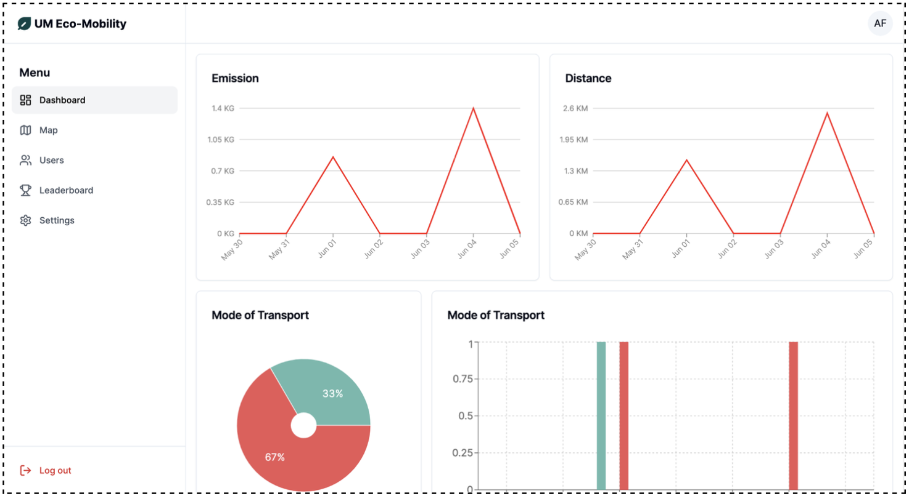
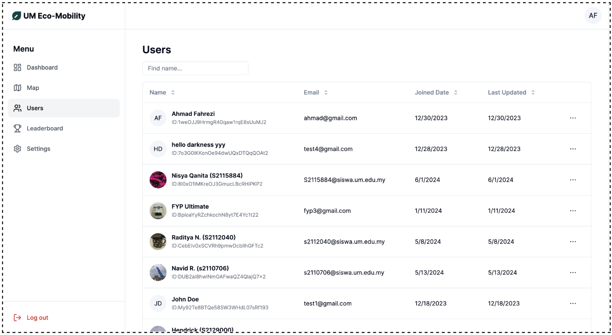
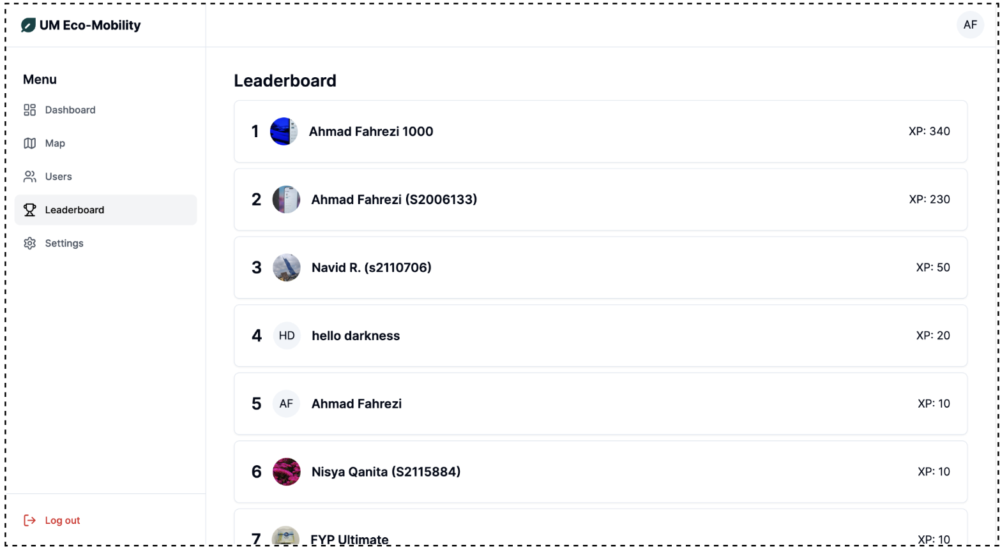
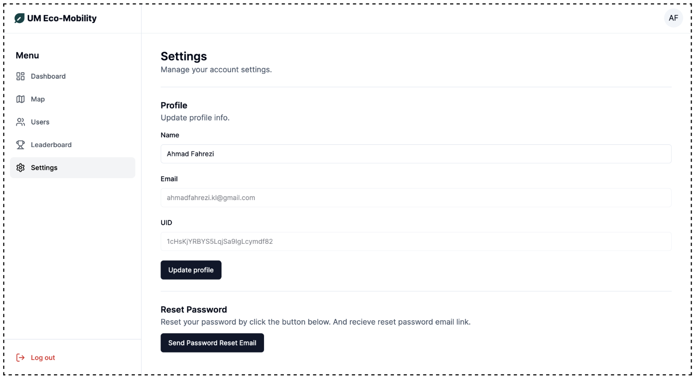

# Eco-Mobility Web App 🍃

Eco-Mobility Web is a web application designed to promote eco-friendly transportation habits among users. The app provides detailed insights and management tools for administrators to track and promote sustainable transportation.

### Project Demo

Check out our [video demonstration](https://drive.google.com/file/d/1uZuzMDYD8rTO7otuSTFCPDF7vLcXapGo/view) to see the project in action.

## Features

- **Admin Dashboard**: Manage users and view detailed summaries of their activities.
- **Charts and Graphs**: Visualize data with interactive charts and graphs.
- **User Management**: Secure user authentication and profile management.
- **Map (Trailling)**: Visualize Trailling collected from Mobile App

## Technologies Used

- **Next.js**: For building the web application.
- **Firebase**: For authentication, Firestore database, and storage.
- **TypeScript**: For type-safe JavaScript.

## Screenshots

### Web App Dashboard



### Web App Map (to see all trailling history)


### Web App User Management



### Web App Leaderboard



### Web App Settings



## Installation

1. Clone the repository:

   ```sh
   mkdir eco-mobility-web
   cd eco-mobility-web
   ```

   ```sh
   git clone https://github.com/ahmadfahrezi81/Eco-Mobility-Web-App.git
   ```
2. Install dependencies:
   You can use either npm or pnpm to install the dependencies. Here are the commands for each:

   Using PNPM:

   ```sh
   pnpm install
   ```

   Alternatively, using NPM:

   ```sh
   npm install
   ```
3. Set up environment variables (the same as the [mobile app](https://github.com/ahmadfahrezi81/Eco-Mobility)):
   Create a `.env` file in the root directory and add your Firebase configuration:

   ```env
   API_KEY=your_api_key
   AUTH_DOMAIN=your_auth_domain
   PROJECT_ID=your_project_id
   STORAGE_BUCKET=your_storage_bucket
   MESSAGING_SENDER_ID=your_messaging_sender_id
   APP_ID=your_app_id
   ```
4. Start the application:

   ```sh
   npm run dev
   ```

## Usage

1. Sign up or log in using your email.
2. Manage users and track their activities.
3. View CO2 emissions and other statistics in the charts.
4. View Mapping based on Trailing History
5. Manage your profile.

## Contributing

We welcome contributions! Please read our Contributing Guidelines for more details.

## Contributing Guidelines

1. Fork the repository.
2. Create a new branch for your feature or bugfix:
   ```sh
   git checkout -b feature/your-feature-name
   ```
3. Make your changes and commit them with clear and concise messages.
4. Push your changes to your forked repository:
   ```sh
   git push origin feature/your-feature-name
   ```
5. Create a pull request to the main repository. Provide a detailed description of your changes and any related issues.

## License

This project is licensed under the MIT License. See the LICENSE file for details.

## Contact

For any inquiries, please contact Ahmad Fahrezi at ahmadfahrezi8127@gmail.com.
